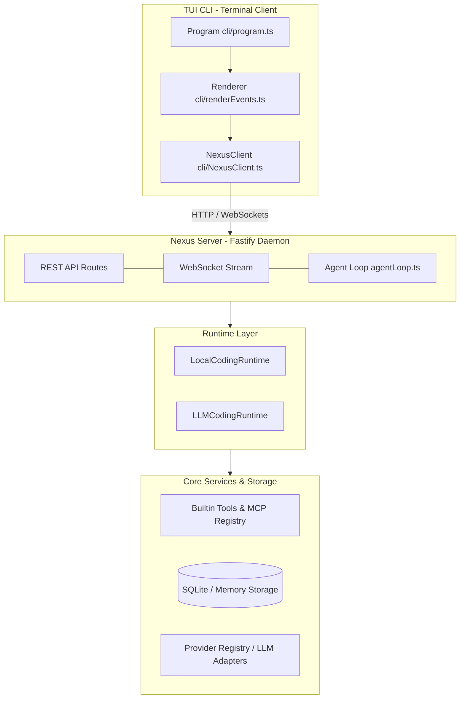

# BabeL-O

<p align="center">
  
  
</p>

<p align="center">
  <strong>Technical support provided by KezhongKe (壳中客).</strong>
</p>

> **A high-performance, Nexus-first generalized AI agent. Built with Fastify and Node.js, featuring an isolated runtime, stdio-based MCP client, dynamic context compaction, and multi-agent coordination, all controllable via a lightweight interactive TUI CLI.**

[简体中文 README](README.zh-CN.md)

---

## What is BabeL-O?

BabeL-O is a **Nexus-first generalized agentic AI system**, shifting the core intelligence and execution out of the client terminal and into a headless server runtime (**Nexus**). It operates under a strict design philosophy:

> **Nexus owns execution. CLI owns interaction.**

By decoupling the terminal user interface (TUI) from the execution engine, BabeL-O can run as a persistent backend service, a headless CI agent, or a containerized task-solving agent, while providing users with a lightning-fast, zero-overhead CLI client (`bbl`) for day-to-day operations.

---

## Architecture

BabeL-O segregates CLI rendering from runtime execution. The client and server communicate via lightweight REST endpoints and a WebSocket event stream.



---

## Key Features

- **Decoupled Engine (Zero React/Ink Dependency)**: Zero React or Ink component overhead. Standard Node.js readline and event streams yield sub-second startup times and clean execution.
- **Dual Runtime execution**:
  - `LocalCodingRuntime`: Deterministic pattern-matching for quick, cost-free local adjustments.
  - `LLMCodingRuntime`: Dynamic agent loop running up to 25 loops per turn, scheduling tool calls and executing actions.
- **Context Compaction & State Rebuild**: Automatically compacts conversations past token thresholds (`compact_boundary`). Unlike typical message truncation, it extracts file reads and active tasks before compaction to reconstruct the system prompt, maintaining long-context memory.
- **Opt-in Docker Sandboxing & Shell HMAC Probe**: Runs shell execution (`bash`) inside Docker containers natively with CPU, memory, and network constraints. Local execution uses cryptographically signed HMAC nonces to prevent CWD spoofing and shell injection attacks.
- **Strict Workspace Path Safety**: Restricts all file accesses to configured workspaces (`pathSafety.ts`). Avoids traversal escapes via symlink checks.
- **Native MCP Stdio client**: Automatically maps stdio-based MCP servers configured in `mcp.json` into risk-classified tools.
- **Planner ➔ Executor ➔ Critic Pipeline**: Coordinates multi-agent flows inside task-scoped Git Worktrees with mutex file locks to enable parallel execution without merge conflicts.
- **Structured Persistent Audits**: Automatically saves all tool inputs, outputs, tokens, and permission logs into SQLite (`node:sqlite`).

---

## Installation

You can install BabeL-O by using the release installer, downloading a pre-compiled native binary directly, or building it from source.

### Method 1: Release Installer (Recommended & Fastest)

On macOS and Linux, the installer detects your platform, downloads the latest matching GitHub release binary, and installs it as `bbl`:

```bash
curl -fsSL https://raw.githubusercontent.com/SuTang-vain/BabeL-O/main/scripts/install.sh | bash
bbl chat
```

### Method 2: Pre-compiled Native Binary

Download the latest standalone executable binary (`bbl` for macOS/Linux, `bbl.exe` for Windows) from [GitHub Releases](https://github.com/SuTang-vain/BabeL-O/releases), or see the [release notes](docs/releases/v0.3.0.md) for version-specific download links.

Move the downloaded binary to a directory in your system `$PATH` (e.g., `/usr/local/bin` on macOS/Linux), and run:
```bash
# Start an interactive chat session directly (no Node.js installation required)
bbl chat
```

---

### Method 3: Build from Source (For Development)

#### Prerequisites

*   **Node.js >= 22** (uses native ESM and native SQLite modules)
*   **npm** or **yarn**
*   *Optional:* Docker (for isolated sandbox execution)

#### Steps:
```bash
# Clone the repository
git clone https://github.com/SuTang-vain/BabeL-O.git
cd BabeL-O

# Install dependencies exactly from package-lock.json
npm ci

# Run unit and integration tests
npm test

# Option A: Build and run via npm scripts
npm run build
npm run start # Start the Nexus background daemon

# Option B: Compile into a native standalone binary
npm run build:binary
```

In a separate terminal, if using Option A, link the CLI globally and start:
```bash
npm link
bbl chat
```
If using Option B, you can run the generated binary directly:
```bash
./dist/bbl chat
```

#### Standalone Native Binary Compilation (Node.js SEA) Features:
* **Fully self-contained**: Runs on target systems without Node.js or `node_modules` pre-installed.
* **Embedded Resources**: Built-in developer skills (`.md` files) are baked directly into the binary as native assets, loaded dynamically at runtime.
* **Homebrew & Stripped Runtime Workaround**: If the compiling environment uses a stripped Node.js binary (common with macOS Homebrew), the build script automatically downloads, caches, and compiles with the official Node.js runtime template.
* **ESM require shim**: Uses dynamic shimming to support CommonJS dependency requirements inside the bundled ESM codebase.

---

## CLI Usage Guide

```bash
bbl chat                  # Start an interactive CLI chat session
bbl run <prompt>          # Run a one-shot prompt task
bbl optimize              # Launch self-optimization workflows
bbl nexus start           # Launch the background Nexus daemon
bbl nexus status          # Query Nexus health status
bbl sessions list         # List persistent sessions
bbl sessions inspect <id> # Inspect session details and trace files
bbl tools list            # List available tools and check permissions
bbl tools audit           # Detailed audit logs of past tool activities
bbl config show           # Display configuration settings
```

### Keyboard Shortcuts in Chat

| Shortcut / Input | Action |
| :--- | :--- |
| `Ctrl+C` | Cancels the active LLM generation loop (does not close CLI) |
| `/help` | Prints the slash palette commands |
| `/clear` | Clears the terminal screen |
| `/exit` | Exits the chat session |
| `/model <id>` | Dynamically switches the active LLM model |
| `/status` | Details the active session configuration and health |
| `y` / `n` | Approves or denies a pending permission request |

---

## Configuration

BabeL-O manages its options via `~/.babel-o/config.json`.

Example configuration:

```json
{
  "providerId": "anthropic",
  "modelId": "claude-3-5-sonnet-20241022",
  "apiKey": "sk-ant-...",
  "baseUrl": "https://api.anthropic.com"
}
```

### Supported Providers

- `anthropic` (supports native prompt caching and reasoning thinking streams)
- `openai` (compatible with standard OpenAI and local models, e.g., Ollama/DeepSeek)
- `local` (mock adapter used for tests and benchmarks)

---

## Nexus API & Streaming Specifications

The Nexus Server runs Fastify and exposes endpoints for custom UIs and remote platforms:

### REST API

- `POST /v1/sessions` - Initiates a persistent session
- `POST /v1/sessions/:id/input` - Submits a prompt payload
- `POST /v1/sessions/:id/approve` / `deny` - Responds to permission requests
- `GET /v1/sessions/:id/tool-traces` - Queries audit trail databases

### WebSocket Endpoint

```
GET /v1/stream?sessionId=<id>
```

Yields a structured event stream (`NexusEvent`):
*   `session_started` / `session_ended`
*   `assistant_delta` (streaming assistant text)
*   `thinking_delta` (streaming raw reasoning blocks)
*   `tool_started` / `tool_completed` / `tool_denied` (tool boundaries)
*   `permission_request` / `permission_response` (interactive loops)
*   `usage` (cost tracking telemetry)
*   `result` / `error` (final execution state)

---

## Directory Structure

```
BabeL-O/
├── bin/
│   └── bbl.js                    # CLI entry point (tsx launcher)
├── src/
│   ├── nexus/                    # Fastify Server, TaskQueue & AgentLoop
│   ├── runtime/                  # Dual Runtimes, context assembly & Compaction
│   ├── tools/                    # Core tools (Read, Edit, Bash) & pathSafety
│   ├── mcp/                      # JSON-RPC MCP clients & wrapping adapters
│   ├── providers/                # Model adapters (Anthropic/OpenAI)
│   ├── cli/                      # Commander commands & text/Chalk UI renderers
│   ├── storage/                  # SQLite storage backend
│   ├── skills/                   # Prompt skill matcher & parser
│   └── shared/                   # Schemas, events, and configuration types
└── test/                         # Unit and integration test suites
```

---

## License

This project is licensed under the MIT License - see the [LICENSE](LICENSE) file for details.
