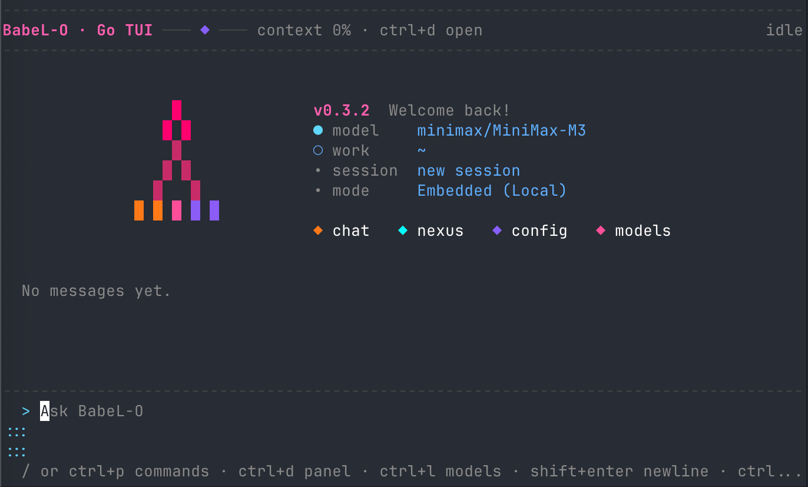

# BabeL-O

<p align="center">
  
  
</p>

<p align="center">
  <strong>Your terminal workspace for durable coding sessions, native TUI workflows, and tool-aware agents.</strong><br />
  Technical support provided by KezhongKe (壳中客).
</p>

<p align="center">
  <a href="https://github.com/SuTang-vain/BabeL-O/releases"></a>
  <a href="https://www.npmjs.com/package/babel-o"></a>
  <a href="https://github.com/SuTang-vain/BabeL-O/actions/workflows/ci.yml"></a>
  <a href="CONTRIBUTING.md"></a>
  <a href="https://github.com/SuTang-vain/BabeL-O/discussions"></a>
</p>

<p align="center">
  
</p>

[简体中文 README](README.zh-CN.md)

## What Is BabeL-O?

BabeL-O is an AI coding agent that lives in your terminal.

It gives you a native Go TUI for day-to-day work, a Nexus runtime that keeps
sessions alive, and a permission-first tool system for reading, editing,
running commands, searching the web, and coordinating work across sessions.

Start the production TUI with:

```bash
bbl go
```

Use it for repo exploration, edits, tests, long migrations, model switching,
context inspection, and session-to-session handoffs without turning your
terminal into a fragile one-shot chat.

## Why BabeL-O?

- **Multiple parallel sessions across worktrees** — Work on isolated workspaces
  simultaneously. The background daemon holds state, so your client can disconnect
  and reconnect without losing tasks.
  *(Technical: worktree isolation + session persistence + WebSocket reconnect)*

- **10MB standalone binary client** — `bbl go` is a Go TUI binary (~10MB) with no
  Node.js dependency. Drop it in a container and run.
  *(Technical: Go Bubble Tea TUI + Node 22+ daemon with native SQLite)*

- **Completes long tasks for real** — Context compaction, tool loop boundaries,
  permission governance, and sub-agent coordination — not a demo-level toy.
  *(Technical: LLMCodingRuntime + TaskSession + AgentLoop + scope governance)*

- **Permission-first tools** — Bash, Write, Edit, MCP tools, and memory writes
  stay visible. Approve once, approve for a session, or reject with feedback.

- **Inspectable context** — `/context` shows budget, compaction, memory,
  recovery, working set, and long-context diagnostics instead of hiding the
  agent's state.

- **Session collaboration** — `/session`, `/inbox`, and SessionChannel let
  sessions exchange findings, handoffs, decisions, and review requests without
  treating those messages as secret instructions.

---

## Quick Start (5 minutes)

> ⚠️ **Requires Node.js >= 22.** If your Node is older, upgrade first.
> For alternative installation methods, see [INSTALLATION.md](docs/INSTALLATION.md).

```bash
# Install globally
npm install -g babel-o

# Initialize with interactive setup (coming soon: bbl config init)
bbl config add anthropic "$ANTHROPIC_API_KEY"
bbl config use anthropic/claude-sonnet-4-6

# Launch the terminal UI
bbl go
```

Then try: **"Explain this repository's main entry point"**

See [Common Commands](#common-commands) for more usage examples.

## Installation

### Recommended: npm global install

```bash
npm install -g babel-o
bbl go
```

Requirements: macOS or Linux, Node.js >= 22.

> For alternative installation methods (release installer, from source), see
> [INSTALLATION.md](docs/INSTALLATION.md).

---

## TUI Keybindings

| Input | Action |
| :--- | :--- |
| `/` | Open the command palette |
| `/model` or `Ctrl+L` | Configure provider, API key, base URL, and model |
| `/session` | Create, select, switch, or copy session IDs |
| `/context` | Inspect context budget and diagnostics |
| `/tools` or `Ctrl+O` | Open the tool panel |
| `/memory` | Inspect MemoryOS status and memory candidates |
| `Ctrl+D` | Open the top status panel |
| `Shift+Enter` | Insert a newline |
| `Esc` | Close the active panel |
| `Ctrl+C` | Open the quit dialog |

## Try It

```text
explain this repository and point me to the entry points
```

```text
read the failing test output, patch the bug, and rerun the smallest useful test
```

```text
create a new session for release notes, then summarize the current changes
```

```text
inspect the current context budget and tell me whether we should compact
```

## Common Commands

```bash
bbl go                            # production Go TUI
bbl run "summarize this repo"     # one-shot prompt, no TUI
bbl doctor                        # local readiness checks
bbl go --check --no-start-nexus   # install and TUI readiness check
bbl nexus status                  # Nexus health
bbl sessions list                 # persisted sessions
bbl inspect-session <sessionId>  # session events and traces
bbl memory status                 # MemoryOS status
bbl tools audit                   # tool and permission audit
bbl config list                   # active configuration
```

## MemoryOS

MemoryOS is optional local long-term memory. It runs as a managed loopback
sidecar, indexes approved session knowledge, and returns memory hints when they
are useful.

It is opt-in, local-first, and never replaces workspace evidence. Memory hits
are hints; files and tool results remain the source of truth.

```bash
bbl memory status
bbl memory setup --yes
bbl memory enable-tools
bbl memory doctor
```

## Configuration

BabeL-O stores local configuration in `~/.babel-o/config.json`.

Supported providers include `anthropic`, `openai`, `deepseek`, `moonshot`,
`ollama`, `zhipu`, `minimax`, and `local`.

Useful checks:

```bash
bbl config list
bbl doctor
bbl go --check
```

## Safety Model

BabeL-O is built around explicit boundaries:

- Workspace path checks protect against traversal and symlink escapes.
- Risky tools require visible permission decisions.
- Tool inputs, outputs, approvals, denials, and usage events are persisted.
- SessionChannel messages are collaboration context, not hidden commands.
- MemoryOS results are hints, not authoritative workspace facts.
- Nexus is the runtime source of truth; the TUI is the interaction layer.

## Architecture

For a deeper public overview of how the CLI, Go TUI, Nexus daemon, runtime,
tools, agents, memory, storage, and observability layers fit together, see
[BabeL-O Architecture](docs/guides/ARCHITECTURE.md).

## Release Notes

As of v0.3.7, the old `bbl chat` TypeScript TUI has been removed from the
release package. The official interactive entrypoint is `bbl go`; `bbl run`
remains available for one-shot automation.

This keeps the install smaller, removes duplicated terminal UI logic, and puts
future interaction work into the native Go TUI.

## Documentation

- [Changelog](CHANGELOG.md)
- [Release notes](docs/releases/README.md)
- [FAQ](docs/guides/FAQ.md)
- [Go TUI client guide](clients/go-tui/README.md)
- [Distribution guide](docs/guides/distribution-guide.md)
- [Nexus planning notes](docs/nexus/README.md)

## License

This project is licensed under the MIT License. See [LICENSE](LICENSE) for details.
