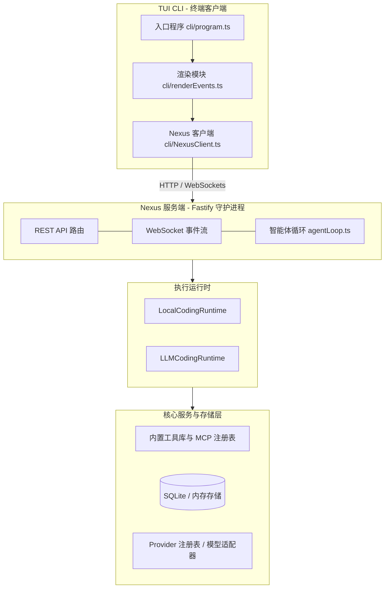

# BabeL-O

> **高性能、以 Nexus 服务端为核心（Nexus-first）的通用泛化 AI 智能体（Generalized Agent）。基于 Node.js 与 Fastify 构建，拥有独立的执行运行时、原生 stdio MCP 客户端、动态上下文压缩与状态重建，支持通过轻量级交互式终端 TUI CLI 进行管控。**

[English README](README.md)

---

## 什么是 BabeL-O？

BabeL-O 采用 **以 Nexus 服务端为核心（Nexus-first）的架构设计**，旨在将智能体核心的状态控制与执行逻辑从终端客户端中剥离，移至无界面（Headless）的服务端运行时（**Nexus**）。它贯彻以下设计原则：

> **Nexus 负责执行与状态，CLI 负责交互。**

通过将终端用户界面（TUI）与核心执行引擎彻底解耦，BabeL-O 不仅能作为一个长驻的后台服务运行，还可以作为 CI 门禁中的无界面智能体或隔离的容器化任务求解智能体；同时，为用户提供一个极速、零开销的终端命令行客户端 `bbl` 进行日常交互。

---

## 架构设计

BabeL-O 实现了渲染与执行的严格分层。客户端与服务端通过轻量级的 REST 路由和双向 WebSocket 事件流进行通信。



---

## 主要特性

- **轻量级解耦（零 React/Ink 依赖）**：摆脱 React 组件树的开销。使用原生 Node.js readline 与流式事件监听，实现毫秒级启动与纯净执行。
- **双运行时设计**：
  - `LocalCodingRuntime`：基于确定性模式匹配，无需调用模型即可超快速响应，节约 Token 消耗。
  - `LLMCodingRuntime`：完整的智能体循环，单轮对话支持多达 25 次工具调用与反复修正。
- **上下文压缩与后压缩状态重建**：在会话逼近 Token 极限时自动触发压缩（`compact_boundary`）。不同于普通的历史截断，它会在压缩前智能抽取模型读取过的关键文件内容 Stub 和当前的任务状态，并将其重新格式化后注入 System Prompt，完美延续长对话的“长期记忆”。
- **可选 Docker 沙箱与 Shell HMAC 防伪探针**：
  - 支持将 Shell 命令执行（`bash`）限制在 Docker 隔离容器中，控制网络（默认禁用）、CPU 和内存。
  - 在本地直接执行 Bash 时，使用基于 HMAC 加密签名的随机 Nonce 对输出进行状态探测，防范 CWD 劫持和 Shell 提示符注入攻击。
- **严格的工作区路径保护**：通过统一的 `pathSafety.ts` 拦截非工作区文件读写，使用 `realpath` 解析真实物理路径，彻底防范利用符号链接（Symlinks）逃逸安全区。
- **原生 MCP Stdio 客户端**：通过 `mcp.json` 配置直接接入 Model Context Protocol 服务端，将其动态包装为经过安全分级的原生工具。
- **Planner ➔ Executor ➔ Critic 编排**：支持在隔离的 Git Worktree 中进行复杂的智能体协作，配合工作区文件系统互斥锁（Mutex Locks）实现安全的并发开发与自动合并/回滚。
- **结构化审计**：所有工具输入输出、模型用量和权限变更日志均自动落盘至 SQLite 数据库（基于原生 `node:sqlite`）。

---

## 安装与部署

你可以通过直接下载预编译的原生二进制包（推荐，最快），或通过源码构建来进行安装。

### 方法一：下载预编译原生二进制包（推荐，最快）

从 [GitHub Releases](https://github.com/SuTang-vain/BabeL-O/releases) 页面下载对应系统的最新单文件可执行二进制包（macOS/Linux 为 `bbl`，Windows 为 `bbl.exe`），也可查看 [版本发布说明](docs/releases/v0.2.8.md) 中的对应下载链接。

将下载好的二进制文件移动到系统环境变量 `$PATH` 包含的目录中（例如 macOS/Linux 下的 `/usr/local/bin`），即可直接全局运行：
```bash
# 启动交互式会话（本地无需安装任何 Node.js 运行环境）
bbl chat
```

---

### 方法二：通过源码构建安装（用于开发调试）

#### 前提条件

*   **Node.js >= 22**（使用了原生 ESM 与 native SQLite 模块）
*   **npm** 或 **yarn**
*   *可选：* Docker（用于运行沙箱环境）

#### 源码构建步骤：
```bash
# 克隆仓库
git clone https://github.com/SuTang-vain/BabeL-O.git
cd BabeL-O

# 安装依赖
npm install

# 运行自动化测试
npm test

# 选项 A：使用 npm 脚本构建运行
npm run build
npm run start # 启动后台守护 Nexus 服务

# 选项 B：编译为单文件原生二进制包
npm run build:binary
```

如果使用**选项 A**，请在另一个终端中全局软链并启动 CLI 客户端：
```bash
npm link
bbl chat
```

如果使用**选项 B**，可直接运行编译好的二进制：
```bash
./dist/bbl chat
```

#### 独立原生二进制包编译 (Node.js SEA) 特性：
* **全自包含 (Self-contained)**：目标运行系统上无需预装 Node.js 环境或 `node_modules` 依赖。
* **内置资源整合 (Embedded Assets)**：内置的开发者技能（`.md` 技能文件）直接作为 SEA Asset 嵌入二进制包中，运行时原生动态加载。
* **Homebrew 优化与剥离处理 (Homebrew Workaround)**：若编译环境使用的是被剥离了符号的 Node 运行时（如 macOS Homebrew 版本），脚本会自动从官方源下载、解压并缓存官方的 Node 模板二进制文件，以防注入失败。
* **ESM require 垫片**：使用动态 Banner 垫片技术，支持打包后 ESM 代码中对 CommonJS 依赖库的无缝调用。

---

## 命令行客户端（bbl）用法说明

```bash
bbl chat                  # 启动交互式终端对话会话
bbl run <prompt>          # 执行单次 Prompt 命令
bbl optimize              # 启动智能体自我优化流
bbl nexus start           # 启动后台守护 Nexus 服务
bbl nexus status          # 检查服务端健康度
bbl sessions list         # 列出所有持久化的会话历史
bbl sessions inspect <id> # 深入检查特定会话的事件日志与工具追踪
bbl tools list            # 列出可用工具集及其安全状态
bbl tools audit           # 审计过往工具执行的风险记录
bbl config show           # 展示当前配置项
```

### 终端交互快捷键

| 快捷键 / 指令 | 功能 |
| :--- | :--- |
| `Ctrl+C` | 中断当前模型的循环生成与工具执行（不会退出客户端） |
| `/help` | 展示斜杠指令面板 |
| `/clear` | 清屏 |
| `/exit` | 退出当前会话 |
| `/model <id>` | 动态切换当前会话所用的 LLM 模型 |
| `/status` | 展示当前服务端配置、授权状态与健康度 |
| `y` / `n` | 批准或拒绝当前的敏感工具权限请求 |

---

## 配置文件说明

BabeL-O 在本地的 `~/.babel-o/config.json` 下维护其配置。

配置范例：

```json
{
  "providerId": "anthropic",
  "modelId": "claude-3-5-sonnet-20241022",
  "apiKey": "sk-ant-...",
  "baseUrl": "https://api.anthropic.com"
}
```

### 兼容的模型供应商

- `anthropic`（支持前缀缓存与原生推理思考块展示）
- `openai`（兼容标准 OpenAI 格式，支持 Ollama/DeepSeek 等本地或第三方端点）
- `local`（本地 Mock 适配器，用于单元测试和基准压测）

---

## Nexus API 与 WebSocket 说明

Nexus 服务端基于 Fastify 构建，暴露标准的 REST 接口与 WebSocket 供第三方界面或自动化脚本接入：

### REST 接口

- `POST /v1/sessions` - 创建会话
- `POST /v1/sessions/:id/input` - 输入用户 Prompt
- `POST /v1/sessions/:id/approve` / `deny` - 提交安全审查响应
- `GET /v1/sessions/:id/tool-traces` - 获取特定会话的工具执行轨迹

### WebSocket 接口

```
GET /v1/stream?sessionId=<id>
```

以 `NexusEvent` 结构返回实时流式事件包：
*   `session_started` / `session_ended`
*   `assistant_delta`（助手的流式文本输出）
*   `thinking_delta`（实时思维链思考块）
*   `tool_started` / `tool_completed` / `tool_denied`（工具执行生命周期）
*   `permission_request` / `permission_response`（交互式安全校验）
*   `usage` (计费与 Token 统计遥测)
*   `result` / `error`（最终结果或致命故障归一化）

---

## 目录结构说明

```
BabeL-O/
├── bin/
│   └── bbl.js                    # CLI 入口（基于 tsx 转发）
├── src/
│   ├── nexus/                    # Fastify API 接口、任务队列与 AgentLoop 多角色协作
│   ├── runtime/                  # 运行时引擎、上下文组装与自动压缩
│   ├── tools/                    # 内置核心工具库（Read、Edit、Bash）与沙箱路径检查
│   ├── mcp/                      # JSON-RPC MCP 协议桥接客户端
│   ├── providers/                # LLM 模型适配层（Anthropic/OpenAI 兼容）
│   ├── cli/                      # Commander 命令注册与 TUI 控制台渲染器
│   ├── storage/                  # SQLite 数据库底层（node:sqlite）
│   ├── skills/                   # 系统提示词技能加载与匹配
│   └── shared/                   # 全局类型定义、标准事件与配置单例
└── test/                         # 自动化测试用例集
```

---

## 开源协议

本项目采用 MIT 开源协议 - 详情请参阅 [LICENSE](LICENSE) 文件。
