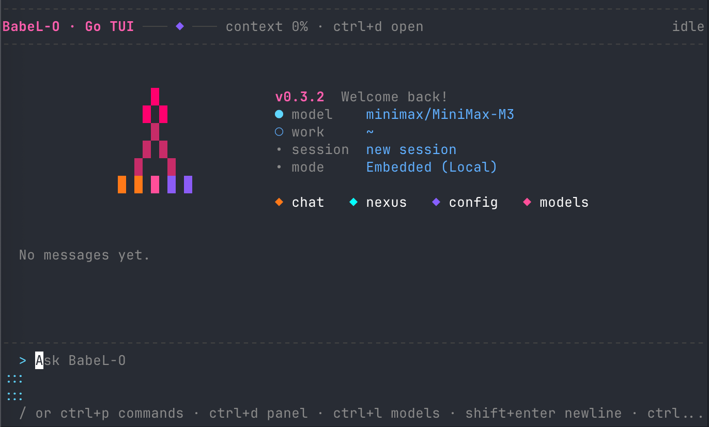

# BabeL-O

<p align="center">
  
  
</p>

<p align="center">
  <strong>面向持久化编码会话、原生 TUI 工作流与工具感知 agent 的终端工作台。</strong><br />
  技术支援由 KezhongKe（壳中客）提供。
</p>

<p align="center">
  <a href="https://github.com/SuTang-vain/BabeL-O/releases"></a>
  <a href="https://www.npmjs.com/package/babel-o"></a>
  <a href="https://github.com/SuTang-vain/BabeL-O/actions/workflows/ci.yml"></a>
  <a href="CONTRIBUTING.md"></a>
  <a href="https://github.com/SuTang-vain/BabeL-O/discussions"></a>
</p>

<p align="center">
  
</p>

[English README](README.md)

## BabeL-O 是什么？

BabeL-O 是一个运行在终端里的 AI 编程 agent。

它把日常交互放进原生 Go TUI，把会话状态交给 Nexus runtime，把文件读取、
代码编辑、命令执行、WebSearch、MCP 与跨 session 协作都纳入显式权限和审计流程。

正式交互入口是：

```bash
bbl go
```

你可以用它阅读仓库、改代码、跑测试、处理长迁移、切换模型、检查上下文、
审批工具调用，以及在多个 session 之间交接工作。

## 为什么选择 BabeL-O？

- **原生终端界面：** `bbl go` 是正式交互客户端，基于 Bubble Tea，支持多行输入、slash 面板、鼠标选择、权限对话框和长 transcript。
- **持久化 session：** Nexus 保存 session 状态、工具 trace、上下文、审批与运行元数据。TUI 断开后，也可以重连、检查、继续。
- **权限优先的工具系统：** Bash、Write、Edit、MCP 工具和 memory 写入都走可见审批。你可以单次批准、session 内批准，也可以拒绝并给出反馈。
- **可见的上下文状态：** `/context` 展示预算、压缩、记忆、恢复、working set 和长上下文诊断，不把 agent 状态藏起来。
- **跨 session 协作：** `/session`、`/inbox` 和 SessionChannel 让不同 session 交换 findings、handoff、决策、review 请求和 memory 候选，但不会把这些消息当作隐藏指令执行。
- **模型与记忆可控：** 在 TUI 内切换 model / provider profile，也可以按需启用本地长期记忆 MemoryOS。

## 安装

### 推荐：release 安装脚本

安装脚本会下载当前平台的轻量 release 包，安装一个很小的 `bbl` launcher，
内置匹配的 Go TUI 二进制，并在结尾运行自检。

```bash
curl -fsSL https://raw.githubusercontent.com/SuTang-vain/BabeL-O/main/scripts/install.sh | bash
bbl go
```

安装指定版本：

```bash
curl -fsSL https://raw.githubusercontent.com/SuTang-vain/BabeL-O/main/scripts/install.sh | BBL_VERSION=v0.3.9 bash
```

要求：macOS 或 Linux，`PATH` 中有 Node.js >= 22。

### npm

适合 Node 开发者和源码安装场景：

```bash
npm install -g babel-o
bbl go
```

对大多数用户来说，release 安装脚本更推荐，因为它会带上当前平台的预编译 Go TUI。

### 从源码构建

```bash
git clone https://github.com/SuTang-vain/BabeL-O.git
cd BabeL-O
npm ci
npm test
npm run build
npm link
cd clients/go-tui && make build
bbl go
```

## 首次使用

配置 provider 和默认 model,然后启动 TUI:

```bash
bbl config add anthropic "$ANTHROPIC_API_KEY"
bbl config use anthropic/claude-sonnet-4-6
bbl go
```

你也可以在 TUI 内用 `/model`(或 `Ctrl+L`)配置 provider 和切换 model。

TUI 内常用入口：

| 输入 | 动作 |
| :--- | :--- |
| `/` | 打开命令面板 |
| `/model` 或 `Ctrl+L` | 配置 provider、API key、base URL 和 model |
| `/session` | 创建、选择、切换或复制 session ID |
| `/context` | 查看上下文预算与诊断 |
| `/tools` 或 `Ctrl+O` | 打开工具面板 |
| `/memory` | 查看 MemoryOS 状态和 memory 候选 |
| `Ctrl+D` | 打开顶部状态面板 |
| `Shift+Enter` | 在输入框中换行 |
| `Esc` | 关闭当前面板 |
| `Ctrl+C` | 打开退出确认 |

## 可以这样试

```text
解释这个仓库，并指出主要入口文件
```

```text
阅读失败测试输出，修复问题，然后只跑最小必要测试
```

```text
为 release note 新建一个 session，然后总结当前变更
```

```text
检查当前 context 预算，并判断是否需要 compact
```

## 常用命令

```bash
bbl go                            # 正式 Go TUI
bbl run "解释这个 repo"           # 一次性 prompt，不打开 TUI
bbl doctor                        # 本地环境自检
bbl go --check --no-start-nexus   # 安装与 TUI 可用性检查
bbl nexus status                  # Nexus 健康状态
bbl sessions list                 # 持久化 session 列表
bbl inspect-session <sessionId>  # session 事件与 trace
bbl memory status                 # MemoryOS 状态
bbl tools audit                   # 工具与权限审计
bbl config list                   # 当前配置
```

## MemoryOS

MemoryOS 是可选的本地长期记忆。它以 loopback sidecar 的形式运行，索引你授权的 session 知识，并在有帮助的时候返回 memory hint。

它是 opt-in、本地优先的能力，永远不会替代工作区证据。memory hit 是提示，文件内容和工具结果才是事实来源。

```bash
bbl memory status
bbl memory setup --yes
bbl memory enable-tools
bbl memory doctor
```

## 配置

BabeL-O 的本地配置保存在 `~/.babel-o/config.json`。

支持的 provider 包括 `anthropic`、`openai`、`deepseek`、`moonshot`、`ollama`、`zhipu`、`minimax` 和 `local`。

常用检查：

```bash
bbl config list
bbl doctor
bbl go --check
```

## 安全模型

BabeL-O 围绕显式边界设计：

- 工作区路径检查会拦截路径遍历和 symlink escape。
- 高风险工具必须经过可见权限决策。
- 工具输入、输出、审批、拒绝和 usage 事件都会持久化。
- SessionChannel 消息是协作上下文，不是隐藏命令。
- MemoryOS 结果是提示，不是工作区事实来源。
- Nexus 是 runtime 状态源，TUI 是交互层。

## Release 说明

从 v0.3.7 开始，旧的 `bbl chat` TypeScript TUI 已从 release 包中移除。
正式交互入口是 `bbl go`；`bbl run` 继续用于一次性自动化和脚本场景。

这样可以减小安装包体积，移除重复的终端 UI 逻辑，并把后续交互体验集中到原生 Go TUI。

## 文档

- [Changelog](CHANGELOG.md)
- [Release notes](docs/releases/README.md)
- [FAQ](docs/guides/FAQ.md)
- [Go TUI 客户端指南](clients/go-tui/README.md)
- [分发指南](docs/guides/distribution-guide.md)
- [Nexus 规划笔记](docs/nexus/README.md)

## 许可证

本项目以 MIT 协议开源，详见 [LICENSE](LICENSE)。
