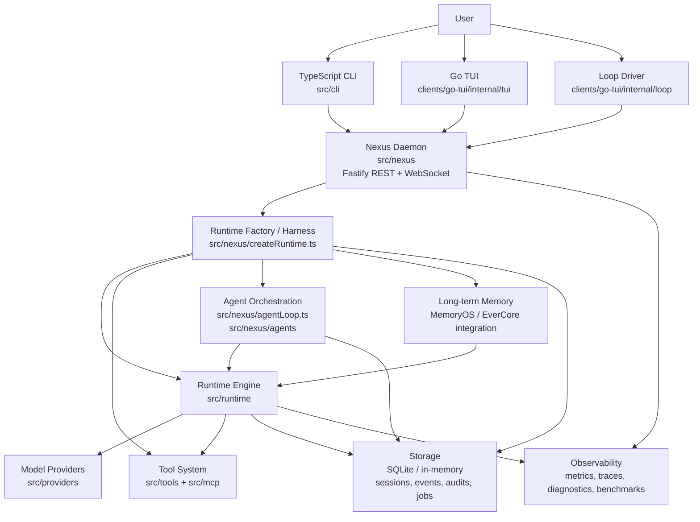
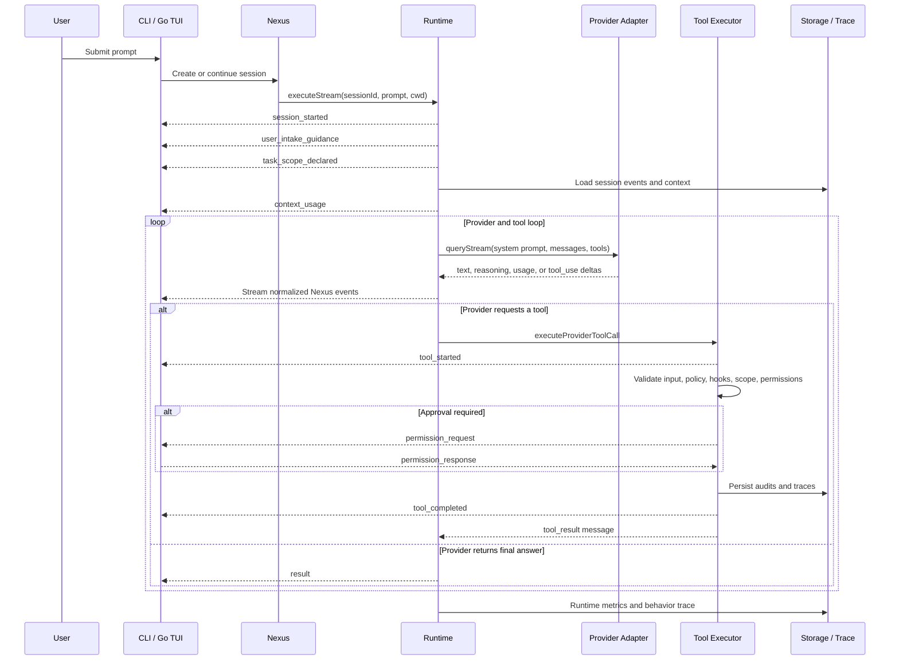

# BabeL-O Architecture

BabeL-O is a Nexus-first AI coding agent runtime. The interactive clients own
the terminal experience, while Nexus owns execution, session state, tool
governance, memory, and streaming events.

This document describes the public architecture as it exists in the current
codebase. It intentionally uses the real module boundaries instead of forcing
the project into framework names that do not exist in the repository.

## System Overview



At a high level:

- **Clients** handle interaction: command parsing, terminal layout, prompts,
  permission dialogs, and event rendering.
- **Nexus** is the execution host: it exposes the API, streams events, creates
  runtimes, stores sessions, and coordinates agents.
- **Runtime** is the execution engine: it assembles context, calls models,
  streams output, executes tools, enforces permissions, and emits canonical
  events.
- **Tools, providers, memory, and storage** are pluggable capabilities used by
  the runtime through stable interfaces.

## Layer Map

| Concept | Current implementation | Notes |
| --- | --- | --- |
| Runtime | `src/runtime` | Streaming execution, provider loop, tool loop, context management, compaction, task scope, permission flow, provider recovery. |
| Framework abstractions | `src/providers/adapters`, `src/tools/Tool.ts`, `src/runtime/hooks.ts`, `src/shared/events.ts` | Model adapters, tool interface, middleware-style hooks, and the shared event schema. |
| Harness | `src/nexus/createRuntime.ts`, `src/tools`, `src/mcp`, `src/nexus/agents`, `src/runtime/memoryProvider.ts` | Wires builtin tools, MCP tools, agent tools, storage, MemoryOS/EverCore, policy, and runtime selection. |
| Observability | `src/runtime/behaviorTrace.ts`, `src/nexus/metrics.ts`, `src/shared/toolTrace.ts`, benchmark modules, session inspection commands | BabeL-O has LangSmith-like diagnostics, but does not depend on LangSmith SDK or export traces to LangSmith by default. |
| Loop | `LLMCodingRuntime`, `runtimeToolLoop.ts`, `src/nexus/agentLoop.ts`, `src/cli/commands/loop.ts`, `clients/go-tui/internal/loop` | There are several loops: model/tool loop, task/agent loop, and the interactive loop driver. |

## Request Flow



## Runtime Engine

The runtime contract is `NexusRuntime.executeStream(...)`, which returns an
async stream of `NexusEvent` values. This keeps all clients on the same event
protocol, whether the user is running `bbl run`, `bbl go`, or a Nexus API
consumer.

The LLM runtime is responsible for:

- building the system prompt and model-visible context,
- loading session history and compact summaries,
- estimating context usage and triggering compaction,
- emitting `task_scope_declared` before the first model call,
- calling the active model adapter,
- streaming model deltas into Nexus events,
- executing tool calls and returning tool results to the model,
- enforcing tool policy, task scope, and permission gates,
- recovering from provider context-window failures where possible,
- emitting final runtime metrics.

The local runtime is used for deterministic and test-oriented execution paths.

## Framework Interfaces

BabeL-O keeps model and tool mechanics behind small interfaces.

Model providers implement the adapter shape in `src/providers/adapters`:

```text
ModelQueryParams -> AsyncIterable<StreamDelta>
```

Tools implement `ToolDefinition` from `src/tools/Tool.ts`. Each tool declares:

- name and description,
- input schema,
- risk level (`read`, `write`, `execute`, or `task`),
- optional model-facing schema,
- optional per-input risk override,
- execute function.

Runtime hooks provide middleware-style extension points around invocation,
tool use, permission requests, and failures. Hooks can deny a tool, update tool
input, provide a permission decision, or add retry hints.

## Harness and Capabilities

`createDefaultNexusRuntime` is the main harness. It creates the default tool
registry, optionally adds MCP tools, optionally adds MemoryOS/EverCore tools,
creates the agent scheduler, resolves storage, configures policy, and selects
the runtime implementation.

The capability surface includes:

- builtin file and command tools such as Read, Write, Edit, Bash, Glob, Grep,
  and WebSearch,
- MCP stdio tool wrapping,
- agent tools backed by the Nexus agent scheduler,
- optional remote runner support for tool execution,
- MemoryOS/EverCore long-term memory retrieval and memory tools,
- SQLite-backed session, event, job, inbox, trace, and audit storage.

## Agent Orchestration

Nexus includes a task and agent orchestration layer for more structured work.
The agent loop supports planner, executor, critic, and optimizer roles; task
queues; planner review; worktree isolation; sub-agent delegation; and
parent-child session channels.

Sub-agents are scheduled through `ExploreAgentScheduler`. A child agent gets a
forked context, a bounded tool set, its own session, and a channel back to the
parent session. The parent can inspect child status and results through Nexus
events and storage.

## Memory Model

Long-term memory is optional and volatile context, not a source of truth.
Memory results are background hints used to help the model recall preferences
or prior session context. Workspace files, tool results, session events, and
SQLite state remain authoritative.

Memory retrieval is cue-driven. The runtime does not search long-term memory
for every prompt; it searches only when the prompt contains explicit recall,
preference, habit, or cross-session cues. Memory writes require explicit user
intent or approved governance candidates and remain permission-gated.

## Observability

BabeL-O has an internal observability layer rather than a built-in LangSmith
integration. The runtime and Nexus emit structured events and diagnostics for:

- context usage and context blocking,
- provider invocation and recovery,
- tool start, completion, denial, and permission decisions,
- task scope declarations and boundary confirmations,
- runtime execution metrics,
- agent-loop role metrics,
- behavior traces written to `.babel-o/behavior-trace.jsonl`,
- session inspection and benchmark workflows.

This gives operators enough information to inspect how a session evolved,
which tools ran, why a tool was denied or approved, how much context was used,
and where recovery or compaction happened.

## Maturity Roadmap

BabeL-O's current architecture is already aligned with modern agent runtime
practice: Nexus owns orchestration, runtime owns execution and governance, and
clients only render interaction. The remaining maturity work is tracked in
[Agent Runtime Architecture Maturity Plan](reference/agent-runtime-architecture-maturity-plan.md).

The main gaps are:

- **Agent Trace Schema:** reconstruct every run as a trajectory of provider,
  tool, permission, scope, memory, compact, recovery, sub-agent, and result
  spans.
- **Trajectory Eval Harness:** evaluate coding-agent behavior from traces, not
  only final text or isolated unit tests.
- **Durable Run Checkpoint / Resume:** define recoverable execution boundaries
  for provider turns, tool calls, and permission waits.
- **Memory Quality Metrics:** measure whether long-term memory is useful,
  stale, contradicted, approved, denied, or over-trusted.
- **MCP Context Primitives:** extend beyond MCP tool wrapping only when
  resources, prompts, or roots can obey Nexus task-scope governance.
- **Loop Taxonomy:** keep `runtime loop`, `tool loop`, `agent loop`, and
  `interaction loop` distinct so only Nexus/runtime own execution truth.

## Safety and Governance

BabeL-O's safety model is runtime-owned:

- clients render permissions but do not re-derive tool risk or task scope,
- risky tool calls pass through policy and permission gates,
- scope-boundary crossings are detected by the runtime before normal tool
  execution,
- permission audits are persisted,
- Bash can be downgraded to read risk for recognized read-only commands,
- MemoryOS results are treated as hints and never replace workspace evidence,
- SessionChannel messages are collaboration context, not hidden instructions.

The key design rule is:

```text
Nexus owns execution. Clients own interaction. Runtime owns tool risk,
task scope, and evidence validation.
```

## Directory Guide

```text
src/cli                 Commander commands and CLI entrypoints
src/nexus               Fastify API, sessions, runtime creation, agents
src/runtime             Streaming runtime, context, compaction, tool loop
src/providers           Model registry and provider adapters
src/tools               Tool interface, registry, builtin tools
src/mcp                 MCP client and MCP tool adapter
src/storage             SQLite and in-memory storage implementations
src/shared              Event schemas, session types, task types, IDs, errors
clients/go-tui          Production Go terminal UI and loop driver
runners/go-runner       Optional Go remote/local tool runner
docs/nexus              Architecture, governance, roadmap, and reference docs
```

## In One Sentence

BabeL-O is a terminal-first coding agent where clients provide interaction,
Nexus provides durable orchestration, the runtime provides model/tool execution,
and the surrounding harness provides tools, memory, agents, storage, and
diagnostics.
